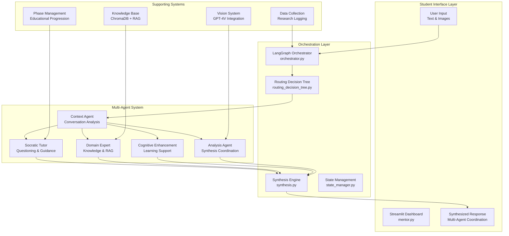

# MEGA Architectural Mentor - Agentic System Architecture

## Executive Summary

The MEGA (Multimodal Educational Guidance for Architecture) agentic system represents a sophisticated multi-agent orchestration platform designed to revolutionize architectural design education. Built on LangGraph, the system coordinates five specialized AI agents that work collaboratively to provide intelligent tutoring, prevent cognitive offloading, and promote deep thinking in spatial design. This document provides a comprehensive overview of the system architecture, agent roles, coordination mechanisms, and educational methodologies.

## System Overview



## Core Architecture Principles

### 1. Multi-Agent Coordination
The system employs five specialized agents, each with distinct pedagogical roles:
- **Collaborative Intelligence**: Agents work together rather than in isolation
- **Contextual Awareness**: Each agent receives tailored context from the Context Agent
- **Adaptive Routing**: Intelligent routing based on student needs and conversation state
- **Synthesis Integration**: Responses are synthesized for coherent, unified guidance

### 2. Educational Philosophy
- **Cognitive Offloading Prevention**: Actively prevents students from becoming passive recipients
- **Socratic Method**: Emphasizes questioning over direct answers
- **Scaffolded Learning**: Provides appropriate support based on student understanding level
- **Metacognitive Development**: Promotes self-reflection and learning awareness

### 3. Technical Architecture
- **LangGraph Orchestration**: State-based workflow management with conditional routing
- **Modular Design**: Each agent is independently developed and maintained
- **Scalable Infrastructure**: ChromaDB for knowledge storage, GPT-4V for vision processing
- **Research Integration**: Comprehensive data collection for educational research

## Multi-Agent System Deep Dive

### 1. Context Agent - The Orchestration Intelligence

**Primary Role**: Conversation analysis, state tracking, and routing intelligence

**Key Capabilities**:
- **Student Input Classification**: Analyzes interaction types, understanding levels, and engagement patterns
- **Conversation Pattern Analysis**: Tracks learning progression, topic focus, and engagement trends
- **Routing Intelligence**: Recommends appropriate agents based on student needs and context
- **Cognitive State Assessment**: Evaluates confidence, understanding, and learning readiness

**Technical Implementation**:
```python
# Core processors for modular functionality
- InputClassificationProcessor: Categorizes student input
- ContentAnalysisProcessor: Analyzes complexity and topics
- ConversationAnalysisProcessor: Tracks patterns and progression
- ContextGenerationProcessor: Creates agent-specific contexts
- ResponseBuilderProcessor: Formats context packages
```

**Agent Coordination Role**:
- Provides tailored context to each agent
- Suggests primary and secondary agent activation
- Calculates routing confidence and priorities
- Identifies special pedagogical considerations

### 2. Socratic Tutor Agent - The Questioning Master

**Primary Role**: Guided questioning, scaffolded learning, and discovery-based education

**Key Capabilities**:
- **Guided Questioning**: Generates thought-provoking questions to guide learning
- **Contextual Inquiry**: Creates questions specific to student's project and understanding level
- **Scaffolded Learning**: Adjusts question difficulty based on student assessment
- **Discovery Learning**: Helps students discover insights rather than providing direct answers
- **Critical Thinking Development**: Promotes analytical and evaluative thinking

**Question Types**:
- **Clarifying Questions**: Help students articulate their thinking clearly
- **Assumption-Challenging Questions**: Question underlying beliefs and assumptions
- **Evidence Questions**: Ask for supporting reasoning and justification
- **Perspective Questions**: Encourage viewing problems from different angles
- **Implication Questions**: Explore consequences and broader impacts of decisions

**Educational Strategies**:
- **Balanced Guidance**: Combines questioning with strategic guidance
- **Socratic Exploration**: Deep exploratory questioning sequences
- **Phase-Based Assessment**: Questions aligned with design phase progression
- **Visual Choice Reasoning**: Gamified questioning for visual analysis

### 3. Domain Expert Agent - The Knowledge Orchestrator

**Primary Role**: Knowledge provision, RAG system integration, and architectural expertise

**Key Capabilities**:
- **Knowledge Base Integration**: Seamless access to architectural documents and precedents
- **RAG System Management**: Advanced search strategies and context retrieval
- **Citation Management**: Proper attribution and source tracking
- **Contextual Knowledge Delivery**: Information tailored to student's specific project needs
- **Example Generation**: Provides relevant architectural precedents and case studies

**Search Strategies**:
- **Semantic Search**: Vector-based similarity matching
- **Keyword Search**: Traditional text-based retrieval
- **Query Expansion**: Enhanced search with related terms
- **Hybrid Approach**: Combines multiple search methods for optimal results

**Knowledge Delivery Modes**:
- **Focused Examples**: Specific architectural precedents and case studies
- **Balanced Guidance**: Strategic knowledge combined with thinking prompts
- **Technical Information**: Detailed architectural specifications and methods
- **Contextual Synthesis**: Knowledge integrated with student's project context

### 4. Cognitive Enhancement Agent - The Learning Catalyst

**Primary Role**: Cognitive offloading prevention, challenge generation, and metacognitive development

**Key Capabilities**:
- **Cognitive Offloading Detection**: Identifies passive learning patterns
- **Assumption Challenging**: Questions overconfident or unsupported statements
- **Deep Thinking Promotion**: Encourages analytical reasoning and reflection
- **Metacognitive Development**: Builds self-awareness and learning strategies
- **Strategic Challenge Generation**: Creates contextual learning challenges

**Enhancement Strategies**:
- **Increase Challenge**: For high engagement, low complexity situations
- **Reduce Cognitive Load**: For overwhelmed or confused students
- **Challenge Assumptions**: For overconfident students
- **Increase Engagement**: For passive or disengaged students
- **Promote Reflection**: For students lacking metacognitive awareness
- **Deepen Analysis**: For shallow thinking patterns
- **Encourage Exploration**: For repetitive or stuck patterns

**Cognitive Interventions**:
- **Scaffolding Adjustments**: Dynamic support level modifications
- **Challenge Calibration**: Optimal difficulty level maintenance
- **Reflection Prompts**: Metacognitive awareness development
- **Engagement Boosters**: Motivation and participation enhancement

### 5. Analysis Agent - The Synthesis Coordinator

**Primary Role**: Pattern recognition, multi-agent synthesis, and comprehensive response orchestration

**Key Capabilities**:
- **Skill Assessment**: Evaluates student architectural knowledge and abilities
- **Design Phase Detection**: Identifies current stage in design process
- **Cognitive State Analysis**: Assesses learning state and readiness
- **Visual Analysis Coordination**: Manages image processing and interpretation
- **Multi-Agent Synthesis**: Coordinates responses from multiple agents

**Analysis Components**:
- **Text Analysis**: Design brief and conversation content analysis
- **Visual Analysis**: Architectural drawing and image interpretation
- **Skill Assessment**: Student capability and knowledge evaluation
- **Phase Detection**: Design process stage identification
- **Cognitive Assessment**: Learning state and engagement evaluation

**Synthesis Coordination**:
- **Response Integration**: Combines multiple agent outputs coherently
- **Quality Assurance**: Ensures response appropriateness and educational value
- **Context Preservation**: Maintains conversation continuity and relevance
- **Educational Alignment**: Ensures responses support learning objectives

## Agent Coordination Patterns

### 1. Sequential Coordination
**Pattern**: Context → Primary Agent → Secondary Agents → Synthesis
- Context Agent analyzes input and suggests routing
- Primary agent generates core response
- Secondary agents provide supporting content
- Synthesis engine combines responses coherently

### 2. Parallel Coordination
**Pattern**: Multiple agents activated simultaneously for comprehensive responses
- Used for complex queries requiring multiple perspectives
- Each agent contributes specialized knowledge or approach
- Synthesis engine manages integration and coherence

### 3. Adaptive Coordination
**Pattern**: Dynamic agent selection based on conversation state
- Routing decisions adapt to student needs and learning progression
- Agent combinations change based on educational phase and understanding level
- Continuous assessment drives coordination adjustments

## Technical Implementation Architecture

### LangGraph Orchestration
```python
# Core orchestration components
- WorkflowState: Manages conversation state and agent results
- Conditional Routing: Dynamic path selection based on analysis
- Node Coordination: Individual agent execution management
- State Validation: Ensures data integrity throughout workflow
```

### Routing Decision Tree
```python
# Intelligent routing system
- Intent Classification: Determines student request type
- Context Analysis: Evaluates conversation state and needs
- Agent Selection: Chooses optimal agent combination
- Priority Weighting: Ranks agent suitability and confidence
```

### Synthesis Engine
```python
# Response integration system
- Multi-Agent Combination: Merges responses coherently
- Quality Enhancement: Applies formatting and readability improvements
- Educational Alignment: Ensures pedagogical appropriateness
- Context Preservation: Maintains conversation continuity
```

## Educational Framework Integration

### Phase Management System
- **Ideation Phase**: Concept development and exploration
- **Visualization Phase**: Spatial representation and design development
- **Materialization Phase**: Technical development and implementation

### Socratic Step Progression
- **Initial Context Reasoning**: Understanding project context and constraints
- **Knowledge Synthesis Trigger**: Connecting concepts and precedents
- **Socratic Questioning**: Deep exploration through guided inquiry
- **Metacognitive Prompt**: Reflection and learning awareness development

### Assessment Integration
- **Real-time Cognitive Metrics**: Continuous learning assessment
- **Adaptive Scaffolding**: Dynamic support level adjustment
- **Progress Tracking**: Learning progression monitoring
- **Research Data Collection**: Comprehensive interaction logging

## System Benefits and Innovations

### Educational Advantages
- **Prevents Cognitive Offloading**: Students remain active learners
- **Promotes Deep Thinking**: Encourages analytical and critical reasoning
- **Adaptive Learning**: Personalized support based on individual needs
- **Metacognitive Development**: Builds self-awareness and learning strategies

### Technical Innovations
- **Multi-Agent Coordination**: Sophisticated agent collaboration patterns
- **Intelligent Routing**: Context-aware agent selection and prioritization
- **Advanced RAG Integration**: Enhanced knowledge retrieval and synthesis
- **Comprehensive Assessment**: Real-time cognitive and learning metrics

### Research Contributions
- **Educational Methodology**: Novel approach to AI-assisted architectural education
- **Cognitive Assessment**: Advanced metrics for learning evaluation
- **Multi-Agent Systems**: Innovative coordination and synthesis techniques
- **Architectural Pedagogy**: Integration of AI with traditional design education

---

*This document provides the foundational understanding of the MEGA agentic system architecture. For detailed implementation guides, see the technical documentation and individual agent specifications.*
