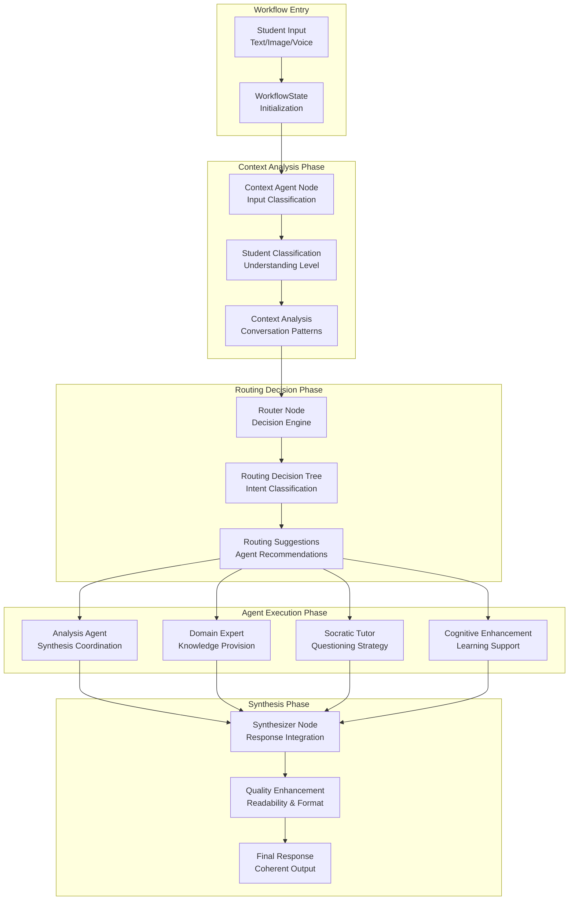

# MEGA Architectural Mentor - Orchestration Workflow System

## Executive Summary

The MEGA orchestration system represents a sophisticated workflow management platform built on LangGraph, designed to coordinate complex multi-agent interactions for educational purposes. The system manages state transitions, routing decisions, agent coordination, and response synthesis through a modular, scalable architecture that ensures coherent and pedagogically appropriate responses to student interactions.

## System Architecture Overview



## Core Orchestration Components

### 1. LangGraph Orchestrator - The Central Coordinator

**Primary Role**: Manages the entire workflow lifecycle from input to final response

**Key Responsibilities**:
- **Agent Initialization**: Creates and configures all specialized agents
- **Workflow Management**: Coordinates state transitions and node execution
- **Routing Coordination**: Manages intelligent agent selection and prioritization
- **State Validation**: Ensures data integrity throughout the workflow
- **Response Synthesis**: Combines multiple agent outputs into coherent responses

**Technical Implementation**:
```python
class LangGraphOrchestrator:
    def __init__(self, domain: str = "architecture", config: Optional[Any] = None):
        # Initialize specialized agents
        self.analysis_agent = AnalysisAgent(domain)
        self.socratic_agent = SocraticTutorAgent(domain)
        self.domain_expert = DomainExpertAgent(domain)
        self.cognitive_enhancement_agent = CognitiveEnhancementAgent(domain)
        self.context_agent = ContextAgent(domain)
        
        # Initialize supporting systems
        self.routing_decision_tree = AdvancedRoutingDecisionTree()
        self.state_validator = StateValidator()
        self.state_monitor = StateMonitor()
```

### 2. Graph Builder - The Workflow Constructor

**Primary Role**: Constructs the LangGraph workflow with nodes and conditional edges

**Workflow Architecture**:
- **Entry Point**: Context Agent (always first)
- **Sequential Flow**: Context → Router → Agent Selection
- **Conditional Routing**: Dynamic agent selection based on analysis
- **Parallel Execution**: Multiple agents can be activated simultaneously
- **Synthesis Integration**: All paths converge at the synthesizer

**Node Configuration**:
```python
def build_workflow(state_cls, handlers, route_decision_fn):
    workflow = StateGraph(state_cls)
    
    # Add all agent nodes
    workflow.add_node("context_agent", handlers.context)
    workflow.add_node("router", handlers.router)
    workflow.add_node("analysis_agent", handlers.analysis)
    workflow.add_node("domain_expert", handlers.domain_expert)
    workflow.add_node("socratic_tutor", handlers.socratic)
    workflow.add_node("cognitive_enhancement", handlers.cognitive)
    workflow.add_node("synthesizer", handlers.synthesizer)
```

**Conditional Routing Map**:
- **Progressive Opening**: Direct to synthesizer for conversation management
- **Knowledge Only**: Route to domain expert for information provision
- **Socratic Exploration**: Route to socratic tutor for questioning
- **Cognitive Challenge**: Route to cognitive enhancement for learning support
- **Multi-Agent Comprehensive**: Route to analysis agent for coordination
- **Balanced Guidance**: Route to analysis agent for synthesis

### 3. Routing Decision Tree - The Intelligence Engine

**Primary Role**: Intelligent agent selection based on student needs and conversation context

**Decision Process**:
1. **Intent Classification**: Determines the type of student request
2. **Context Analysis**: Evaluates conversation state and learning progression
3. **Agent Suitability**: Assesses which agents are most appropriate
4. **Priority Weighting**: Ranks agent combinations by effectiveness
5. **Route Selection**: Chooses optimal path through the workflow

**Routing Strategies**:
- **Educational Priority**: Learning objectives take precedence
- **Context Awareness**: Decisions based on conversation history
- **Adaptive Selection**: Routes change based on student progression
- **Gamification Integration**: Special routing for interactive learning elements

**Classification Categories**:
```python
# Core routing paths with educational intent
ROUTING_PATHS = {
    "knowledge_only": "Direct information provision",
    "socratic_exploration": "Guided questioning and discovery",
    "cognitive_challenge": "Learning support and challenge",
    "multi_agent_comprehensive": "Complex multi-perspective response",
    "balanced_guidance": "Strategic guidance with questioning",
    "progressive_opening": "Conversation management",
    "topic_transition": "Subject area transitions"
}
```

### 4. State Management System - The Data Coordinator

**Primary Role**: Manages conversation state, agent results, and workflow data

**WorkflowState Structure**:
```python
class WorkflowState(TypedDict):
    # Core state
    student_state: ArchMentorState
    last_message: str
    
    # Context analysis
    student_classification: Dict[str, Any]
    context_analysis: Dict[str, Any]
    routing_decision: Dict[str, Any]
    
    # Agent results
    analysis_result: Dict[str, Any]
    domain_expert_result: Dict[str, Any]
    socratic_result: Dict[str, Any]
    cognitive_enhancement_result: Dict[str, Any]
    
    # Final output
    final_response: str
    response_metadata: Dict[str, Any]
```

**State Validation**:
- **Input Validation**: Ensures all required data is present
- **Type Checking**: Validates data types and structures
- **Consistency Checks**: Ensures state coherence across transitions
- **Error Handling**: Manages invalid states and recovery

**State Monitoring**:
- **Transition Tracking**: Records all state changes
- **Performance Metrics**: Monitors processing times and efficiency
- **Error Logging**: Captures and reports state-related issues
- **Debug Information**: Provides detailed state inspection capabilities

### 5. Node System - The Execution Framework

**Node Architecture**: Each agent is wrapped in a standardized node interface

**Node Responsibilities**:
- **Input Validation**: Ensures proper state format
- **Agent Execution**: Calls the appropriate agent with validated input
- **Output Formatting**: Standardizes agent responses
- **Error Handling**: Manages agent-specific errors
- **State Updates**: Updates workflow state with agent results

**Node Types**:

#### Context Node
```python
def make_context_node(context_agent, progression_manager, first_response_generator, 
                     state_validator, state_monitor, logger):
    async def handler(state: WorkflowState) -> WorkflowState:
        # Validate input state
        validation_result = state_validator.validate_state(state["student_state"])
        
        # Execute context analysis
        context_result = await context_agent.analyze_context(state)
        
        # Update state with analysis results
        state["context_analysis"] = context_result
        return state
```

#### Router Node
```python
def make_router_node(route_decision_fn, state_validator, state_monitor, logger):
    def handler(state: WorkflowState) -> WorkflowState:
        # Extract routing context
        routing_suggestions = state.get("context_analysis", {}).get("routing_suggestions", {})
        
        # Make routing decision
        routing_path = route_decision_fn(state)
        
        # Update state with routing decision
        state["routing_decision"] = {
            "path": routing_path,
            "reasoning": routing_reasoning
        }
        return state
```

#### Agent Nodes
```python
def make_analysis_node(analysis_agent, state_validator, state_monitor, logger, progression_manager):
    async def handler(state: WorkflowState) -> WorkflowState:
        # Execute agent analysis
        analysis_result = await analysis_agent.analyze_student_work(state)
        
        # Update state with results
        state["analysis_result"] = analysis_result
        return state
```

#### Synthesizer Node
```python
def make_synthesizer_node(synthesize_fn, ensure_quality_fn, state_validator, state_monitor, logger):
    def handler(state: WorkflowState) -> WorkflowState:
        # Synthesize all agent responses
        final_response, metadata = synthesize_fn(state)
        
        # Apply quality enhancements
        enhanced_response = ensure_quality_fn(final_response, "synthesized")
        
        # Update state with final response
        state["final_response"] = enhanced_response
        state["response_metadata"] = metadata
        return state
```

## Workflow Execution Patterns

### 1. Sequential Execution Pattern
**Use Case**: Simple, single-agent responses
**Flow**: Context → Router → Single Agent → Synthesizer
**Example**: Knowledge-only requests that require domain expert information

### 2. Multi-Agent Coordination Pattern
**Use Case**: Complex queries requiring multiple perspectives
**Flow**: Context → Router → Analysis Agent → Domain Expert → Socratic Tutor → Cognitive Enhancement → Synthesizer
**Example**: Comprehensive architectural guidance combining knowledge, questioning, and learning support

### 3. Adaptive Routing Pattern
**Use Case**: Context-dependent agent selection
**Flow**: Context → Router → Dynamic Agent Selection → Synthesizer
**Example**: Routing based on student understanding level and conversation phase

### 4. Parallel Processing Pattern
**Use Case**: Simultaneous agent activation for efficiency
**Flow**: Context → Router → Multiple Agents (Parallel) → Synthesizer
**Example**: Visual analysis combined with textual assessment

## Synthesis Engine - The Response Integrator

**Primary Role**: Combines multiple agent outputs into coherent, educational responses

**Synthesis Strategies**:

### Route-Specific Synthesis
```python
def _synthesize_by_routing_path(self, routing_path: str, agent_results: Dict[str, Any]):
    if routing_path == "knowledge_only":
        return self._synthesize_knowledge_only_response(agent_results)
    elif routing_path == "socratic_exploration":
        return self._synthesize_socratic_exploration_response(agent_results)
    elif routing_path == "multi_agent_comprehensive":
        return self._synthesize_multi_agent_comprehensive_response(agent_results)
```

### Multi-Agent Integration
- **Content Balancing**: Ensures appropriate weight for each agent's contribution
- **Coherence Management**: Maintains logical flow and consistency
- **Educational Alignment**: Preserves pedagogical intent and learning objectives
- **Quality Enhancement**: Applies formatting and readability improvements

### Response Quality Control
- **Length Management**: Ensures appropriate response length
- **Readability Enhancement**: Improves clarity and structure
- **Educational Appropriateness**: Validates pedagogical effectiveness
- **Consistency Checking**: Ensures coherent messaging across agents

## Advanced Features

### 1. Error Handling and Recovery
- **Graceful Degradation**: System continues functioning with reduced capability
- **Fallback Mechanisms**: Alternative paths when primary routes fail
- **Error Logging**: Comprehensive error tracking and reporting
- **State Recovery**: Ability to restore valid states after errors

### 2. Performance Optimization
- **Caching Mechanisms**: Reduces redundant processing
- **Parallel Execution**: Simultaneous agent processing where possible
- **Resource Management**: Efficient memory and processing utilization
- **Response Time Optimization**: Minimizes latency in agent coordination

### 3. Monitoring and Analytics
- **Real-time Monitoring**: Live tracking of workflow execution
- **Performance Metrics**: Processing times, success rates, error frequencies
- **Educational Analytics**: Learning effectiveness and student engagement metrics
- **System Health**: Overall system performance and reliability indicators

## Integration with Educational Framework

### Phase-Aware Orchestration
- **Design Phase Detection**: Workflow adapts to current design phase
- **Progressive Complexity**: Agent selection based on learning progression
- **Scaffolding Integration**: Dynamic support level adjustment
- **Assessment Alignment**: Coordination with cognitive metrics and evaluation

### Research Data Collection
- **Interaction Logging**: Comprehensive recording of all workflow steps
- **Agent Performance Tracking**: Individual agent effectiveness metrics
- **Educational Outcome Measurement**: Learning progression and achievement data
- **Comparative Analysis**: Data for research validation and improvement

---

*This orchestration system provides the foundation for sophisticated multi-agent educational interactions, ensuring coherent, pedagogically appropriate, and contextually relevant responses to student needs.*
