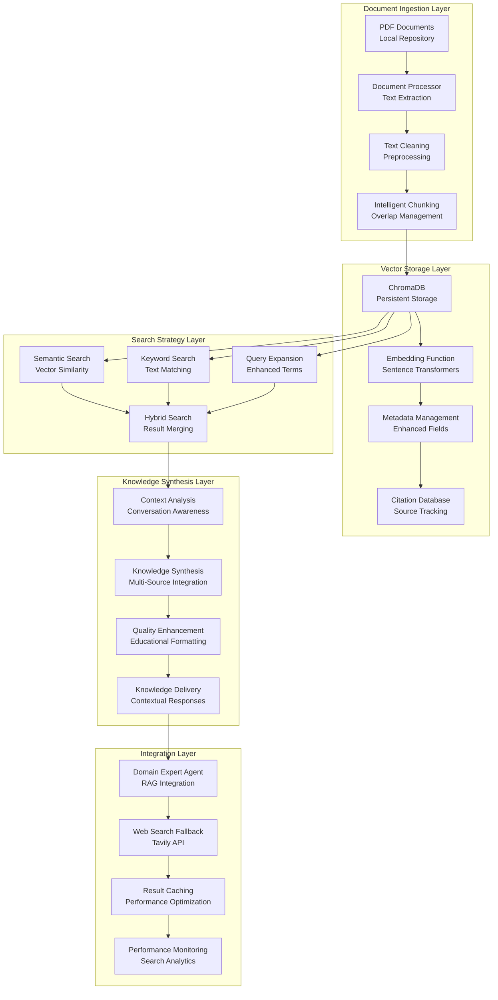

# MEGA Architectural Mentor - Knowledge Base & RAG System

## Executive Summary

The MEGA Knowledge Base & RAG (Retrieval-Augmented Generation) system represents a sophisticated information retrieval and synthesis platform designed specifically for architectural education. Built on ChromaDB with advanced embedding technologies, the system provides intelligent document processing, multi-strategy search capabilities, and contextual knowledge delivery that enhances the educational experience while maintaining academic rigor through proper citation management.

## System Architecture Overview



## Core Components Deep Dive

### 1. Knowledge Manager - The Central Orchestrator

**Primary Role**: Manages the entire knowledge lifecycle from document ingestion to search result delivery

**Key Capabilities**:
- **Document Processing**: Automated PDF ingestion with text extraction and cleaning
- **Intelligent Chunking**: Context-aware text segmentation with overlap management
- **Vector Storage**: ChromaDB integration with enhanced embedding functions
- **Multi-Strategy Search**: Semantic, keyword, and expanded query search capabilities
- **Citation Management**: Academic source tracking and reference maintenance

**Technical Implementation**:
```python
class KnowledgeManager:
    def __init__(self, domain: str = "architecture"):
        # ChromaDB setup with persistent storage
        self.client = chromadb.PersistentClient(path=str(self.base_path / "vectorstore"))
        self.collection_name = f"{domain}_knowledge"
        
        # Enhanced embedding function
        self.embedding_function = self._get_better_embeddings()
        
        # Collection initialization with metadata
        self.collection = self.client.get_or_create_collection(
            name=self.collection_name,
            embedding_function=self.embedding_function,
            metadata={"description": f"Enhanced knowledge base for {domain}"}
        )
```

### 2. Document Processing Pipeline

**Document Ingestion Workflow**:
1. **PDF Detection**: Scans local PDF repository for new documents
2. **Text Extraction**: Uses PyMuPDF for high-quality text extraction
3. **Metadata Extraction**: Captures title, author, source type, and document properties
4. **Text Cleaning**: Removes artifacts, normalizes formatting, handles special characters
5. **Intelligent Chunking**: Creates overlapping segments optimized for retrieval
6. **Vector Storage**: Generates embeddings and stores in ChromaDB with enhanced metadata

**Chunking Strategy**:
```python
def split_text_into_chunks(self, text: str, max_length: int = 800, overlap: int = 100) -> List[str]:
    """
    Intelligent chunking with sentence boundary preservation and overlap management
    """
    # Sentence-aware chunking
    sentences = self._split_into_sentences(text)
    chunks = []
    current_chunk = ""
    
    for sentence in sentences:
        if len(current_chunk + sentence) <= max_length:
            current_chunk += sentence + " "
        else:
            if current_chunk:
                chunks.append(current_chunk.strip())
                # Overlap management for context preservation
                current_chunk = self._create_overlap(current_chunk, overlap) + sentence + " "
            else:
                current_chunk = sentence + " "
    
    return chunks
```

**Enhanced Metadata Fields**:
```python
chunk_metadata = {
    "title": document_title,
    "author": document_author,
    "source_type": source_classification,
    "chunk_index": chunk_number,
    "total_chunks": total_chunk_count,
    "complexity_score": calculated_complexity,
    "has_measurements": measurement_detection,
    "has_materials": material_keyword_detection,
    "has_spatial_info": spatial_keyword_detection,
    "document_section": section_classification
}
```

### 3. Multi-Strategy Search System

**Search Architecture**: Three complementary search strategies combined for optimal results

#### Semantic Search
**Purpose**: Vector similarity matching for conceptual relevance
**Technology**: Sentence-transformers embeddings with cosine similarity
**Strengths**: Understands conceptual relationships and context
**Implementation**:
```python
def _semantic_search(self, query: str, n_results: int) -> List[Dict]:
    results = self.collection.query(
        query_texts=[query],
        n_results=min(n_results, self.collection.count())
    )
    
    search_results = []
    for doc, metadata, distance in zip(results["documents"][0], 
                                      results["metadatas"][0], 
                                      results["distances"][0]):
        similarity = 1.0 - distance
        if similarity > 0.2:  # Quality threshold
            search_results.append({
                "content": doc,
                "metadata": metadata,
                "similarity": similarity,
                "search_method": "semantic"
            })
    
    return search_results
```

#### Keyword Search
**Purpose**: Exact term matching for specific technical information
**Technology**: Text-based matching with relevance scoring
**Strengths**: Finds specific terms, measurements, and technical specifications
**Implementation**:
```python
def _keyword_search(self, query: str, n_results: int) -> List[Dict]:
    # Extract meaningful keywords
    keywords = self._extract_keywords(query)
    
    # Search with keyword filtering
    results = self.collection.query(
        query_texts=[query],
        where={"$or": [{"content": {"$contains": kw}} for kw in keywords]},
        n_results=n_results
    )
    
    return self._process_keyword_results(results, keywords)
```

#### Query Expansion Search
**Purpose**: Enhanced search with related terms and synonyms
**Technology**: AI-powered query expansion with architectural terminology
**Strengths**: Captures related concepts and alternative terminology
**Implementation**:
```python
def _expanded_search(self, query: str, n_results: int) -> List[Dict]:
    # Intelligent query expansion
    expanded_query = self._expand_query_intelligently(query)
    
    results = self.collection.query(
        query_texts=[expanded_query],
        n_results=n_results
    )
    
    return self._process_expanded_results(results, expanded_query)

def _expand_query_intelligently(self, query: str) -> str:
    """AI-powered query expansion with architectural context"""
    architectural_synonyms = {
        "sustainable": ["green", "eco-friendly", "environmental", "LEED"],
        "materials": ["construction", "building materials", "structural"],
        "design": ["architectural design", "planning", "concept"]
    }
    
    expanded_terms = []
    for term in query.split():
        expanded_terms.append(term)
        if term.lower() in architectural_synonyms:
            expanded_terms.extend(architectural_synonyms[term.lower()])
    
    return " ".join(expanded_terms)
```

### 4. Result Merging and Ranking

**Hybrid Search Strategy**: Combines results from all search methods with intelligent deduplication

**Merging Process**:
1. **Result Collection**: Gather results from all search strategies
2. **Deduplication**: Remove duplicate content based on similarity thresholds
3. **Relevance Scoring**: Calculate composite relevance scores
4. **Quality Filtering**: Apply minimum quality thresholds
5. **Ranking**: Sort by relevance and educational value

**Scoring Algorithm**:
```python
def _calculate_composite_score(self, result: Dict) -> float:
    base_score = result.get("similarity", 0.0)
    
    # Boost for multiple search method matches
    method_bonus = 0.1 if result.get("matched_methods", 1) > 1 else 0.0
    
    # Boost for educational content
    educational_bonus = 0.05 if result.get("metadata", {}).get("source_type") == "academic" else 0.0
    
    # Boost for comprehensive content
    content_bonus = 0.03 if len(result.get("content", "")) > 500 else 0.0
    
    return base_score + method_bonus + educational_bonus + content_bonus
```

### 5. Citation Management System

**Academic Integrity**: Comprehensive source tracking and reference management

**Citation Database Structure**:
```python
citation_metadata = {
    "document_id": unique_identifier,
    "title": document_title,
    "authors": author_list,
    "publication_year": year,
    "source_type": classification,
    "url": source_url,
    "doi": digital_object_identifier,
    "pages": page_range,
    "publisher": publisher_info,
    "keywords": extracted_keywords,
    "abstract": document_abstract
}
```

**Citation Integration**: Automatic citation generation for all retrieved content
```python
def generate_citation(self, document_metadata: Dict) -> str:
    """Generate properly formatted academic citations"""
    if document_metadata.get("source_type") == "academic":
        return self._format_academic_citation(document_metadata)
    elif document_metadata.get("source_type") == "web":
        return self._format_web_citation(document_metadata)
    else:
        return self._format_generic_citation(document_metadata)
```

### 6. Domain Expert Integration

**RAG Integration**: Seamless integration with the Domain Expert Agent for contextual knowledge delivery

**Knowledge Request Processing**:
```python
async def provide_knowledge(self, state: ArchMentorState, context_classification: Dict,
                          analysis_result: Dict, routing_decision: Dict) -> AgentResponse:
    # Extract user query and context
    user_input = self._extract_user_query(state)
    building_type = self._extract_building_type(state)
    project_context = self._extract_project_context(state)
    
    # Perform enhanced search
    knowledge_results = self.knowledge_manager.enhanced_search(
        query=user_input,
        n_results=5,
        enable_reranking=True
    )
    
    # Synthesize knowledge with context
    synthesized_response = await self._synthesize_contextual_knowledge(
        knowledge_results, user_input, building_type, project_context
    )
    
    return self._format_educational_response(synthesized_response)
```

### 7. Web Search Fallback System

**Tavily Integration**: Web search fallback for queries not covered by local knowledge base

**Fallback Strategy**:
1. **Local Search First**: Always attempt local knowledge base search
2. **Result Quality Assessment**: Evaluate local search result quality
3. **Web Search Trigger**: Activate web search if local results insufficient
4. **Result Integration**: Combine local and web results intelligently
5. **Caching**: Store web results for future use

**Web Search Implementation**:
```python
async def search_web_for_knowledge(self, topic: str, state: ArchMentorState = None) -> List[Dict]:
    """Web search using Tavily API with caching and fallback"""
    
    # Check cache first
    cache_key = self._generate_cache_key(topic, state)
    if cache_key in self._web_cache:
        return self._web_cache[cache_key]
    
    try:
        # Tavily API search
        tavily_results = await self._search_tavily(topic, state)
        
        # Process and format results
        formatted_results = self._format_web_results(tavily_results)
        
        # Cache results
        self._cache_web_results(cache_key, formatted_results)
        
        return formatted_results
        
    except Exception as e:
        # Fallback to architectural knowledge
        return self._get_architectural_knowledge_fallback(topic)
```

### 8. Performance Optimization

**Caching Strategy**: Multi-level caching for improved response times
- **Embedding Cache**: Stores computed embeddings for common queries
- **Search Result Cache**: Caches search results for frequent queries
- **Web Search Cache**: Stores web search results to reduce API calls
- **Synthesis Cache**: Caches synthesized responses for similar contexts

**Memory Management**: Efficient resource utilization
- **Lazy Loading**: Load embeddings and collections on demand
- **Memory Monitoring**: Track memory usage and optimize accordingly
- **Garbage Collection**: Regular cleanup of unused cache entries
- **Connection Pooling**: Efficient database connection management

## Educational Integration Features

### 1. Context-Aware Knowledge Delivery

**Adaptive Content**: Knowledge delivery adapted to student understanding level and project context

**Context Analysis**:
```python
def analyze_educational_context(self, state: ArchMentorState) -> Dict[str, Any]:
    return {
        "student_level": self._assess_student_level(state),
        "design_phase": self._detect_design_phase(state),
        "project_type": self._extract_project_type(state),
        "learning_objectives": self._identify_learning_objectives(state),
        "prior_knowledge": self._assess_prior_knowledge(state)
    }
```

### 2. Progressive Knowledge Scaffolding

**Difficulty Adaptation**: Content complexity adjusted based on student progression
- **Beginner Level**: Fundamental concepts with clear explanations
- **Intermediate Level**: Detailed technical information with examples
- **Advanced Level**: Complex theoretical concepts and cutting-edge research

### 3. Multi-Modal Knowledge Support

**Content Types**: Support for various knowledge formats
- **Textual Information**: Academic papers, articles, and documentation
- **Visual References**: Architectural drawings, diagrams, and photographs
- **Case Studies**: Real-world project examples and precedents
- **Technical Specifications**: Building codes, standards, and guidelines

## Quality Assurance and Validation

### 1. Content Quality Metrics

**Quality Assessment**: Automated evaluation of knowledge base content
- **Relevance Scoring**: Measures content relevance to architectural education
- **Accuracy Validation**: Cross-references information across sources
- **Completeness Assessment**: Evaluates coverage of key topics
- **Currency Tracking**: Monitors information freshness and updates

### 2. Search Performance Monitoring

**Performance Metrics**: Continuous monitoring of search effectiveness
- **Response Time**: Measures search and retrieval latency
- **Result Quality**: Evaluates relevance and usefulness of results
- **User Satisfaction**: Tracks educational effectiveness of delivered content
- **Coverage Analysis**: Identifies knowledge gaps and improvement opportunities

### 3. Educational Effectiveness Tracking

**Learning Impact**: Measures the educational value of knowledge delivery
- **Comprehension Improvement**: Tracks student understanding progression
- **Engagement Metrics**: Monitors student interaction with delivered content
- **Knowledge Retention**: Evaluates long-term learning outcomes
- **Application Success**: Measures practical application of delivered knowledge

---

*This Knowledge Base & RAG system provides the foundation for intelligent, contextual, and educationally effective knowledge delivery in architectural design education, ensuring students receive relevant, accurate, and appropriately scaffolded information to support their learning journey.*
