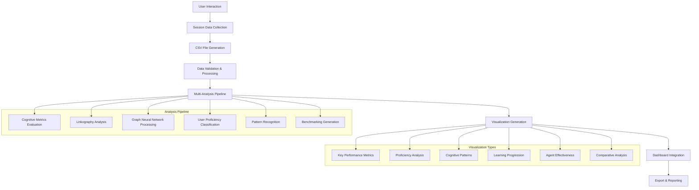

# MEGA Architectural Mentor: Data Flow and Visualization Pipeline

**Version**: 1.0  
**Date**: August 19, 2025  
**Author**: AI Analysis System  

## Table of Contents

1. [Executive Summary](#executive-summary)
2. [Data Flow Architecture](#data-flow-architecture)
3. [Data Collection and Input](#data-collection-and-input)
4. [Processing Pipeline Stages](#processing-pipeline-stages)
5. [Visualization Generation System](#visualization-generation-system)
6. [Dashboard Structure and Sections](#dashboard-structure-and-sections)
7. [Export and Reporting System](#export-and-reporting-system)
8. [File Format Specifications](#file-format-specifications)
9. [Technical Implementation](#technical-implementation)
10. [Data Quality and Validation](#data-quality-and-validation)

---

## Executive Summary

The MEGA Architectural Mentor implements a comprehensive data flow and visualization pipeline that transforms user interactions into actionable insights about cognitive performance and learning effectiveness. The system follows a multi-stage approach: **Data Collection** → **Processing & Analysis** → **Visualization Generation** → **Dashboard Presentation** → **Export & Reporting**.

### Key Pipeline Components:
- **12 distinct data file types** (interactions, metrics, design moves)
- **9 analysis modules** (cognitive evaluation, linkography, GNN modeling)
- **6 visualization categories** with 15+ chart types
- **3 export formats** (interactive HTML, static PNG, JSON reports)
- **Real-time dashboard** with 8 major sections

---

## Data Flow Architecture



### Data Flow Stages

| Stage | Input | Process | Output | Duration |
|-------|-------|---------|---------|----------|
| 1. Collection | User interactions | Real-time logging | CSV files | Live |
| 2. Validation | Raw CSV files | Schema validation | Validated datasets | ~2-5 seconds |
| 3. Analysis | Validated data | Multi-module processing | Evaluation reports | ~10-30 seconds |
| 4. Visualization | Analysis results | Chart generation | HTML/PNG files | ~5-15 seconds |
| 5. Dashboard | Visualizations | Integration & styling | Interactive dashboard | ~3-8 seconds |
| 6. Export | All components | Format conversion | Reports & archives | ~2-10 seconds |

---

## Data Collection and Input

### Primary Data Sources

#### 1. Interaction Data (`interactions_*.csv`)
**Purpose**: Captures every user-system interaction with cognitive analysis

**Key Fields**:
```csv
session_id,timestamp,interaction_number,student_input,input_length,input_type,
student_skill_level,understanding_level,confidence_level,engagement_level,
agent_response,response_length,routing_path,agents_used,response_type,
primary_agent,cognitive_flags,prevents_cognitive_offloading,
encourages_deep_thinking,provides_scaffolding,maintains_engagement
```

**Data Flow**:
```
User Input → Agent Processing → Response Generation → Cognitive Analysis → CSV Logging
```

#### 2. Metrics Data (`metrics_*.csv`)
**Purpose**: Tracks quantitative performance indicators

**Key Metrics Tracked**:
- Cognitive offloading prevention rate
- Deep thinking engagement score
- Scaffolding effectiveness rating
- Knowledge integration metrics
- Skill progression indicators

#### 3. Design Moves Data (`design_moves_*.csv`)
**Purpose**: Records design decision patterns for linkography analysis

**Applications**:
- Design process flow analysis
- Creative breakthrough detection
- Cognitive pattern identification

### Data Collection Flow Diagram

```
┌─────────────────┐    ┌─────────────────┐    ┌─────────────────┐
│   User Input    │───▶│  Agent System   │───▶│ Response Gen.   │
└─────────────────┘    └─────────────────┘    └─────────────────┘
         │                       │                       │
         ▼                       ▼                       ▼
┌─────────────────┐    ┌─────────────────┐    ┌─────────────────┐
│ Input Analysis  │    │ Cognitive Eval  │    │ Output Analysis │
└─────────────────┘    └─────────────────┘    └─────────────────┘
         │                       │                       │
         └───────────────────────┼───────────────────────┘
                                 ▼
                    ┌─────────────────┐
                    │   CSV Storage   │
                    └─────────────────┘
```

---

## Processing Pipeline Stages

### Stage 1: Data Validation (`session_validator.py`)

**Purpose**: Ensures data quality and completeness before analysis

**Validation Checks**:
- Required column presence
- Data type consistency  
- Value range validation
- Session completeness verification

**Implementation**:
```python
def get_valid_session_files(data_dir: Path) -> List[Path]:
    # Validates CSV structure and content
    # Returns only files meeting quality standards
```

### Stage 2: Cognitive Metrics Evaluation (`evaluation_metrics.py`)

**Core Class**: `CognitiveMetricsEvaluator`

**Key Metrics Calculated**:

#### Cognitive Offloading Prevention
- **Formula**: `(responses_preventing_offloading / total_responses) * 100`
- **Threshold**: >70% for effective prevention
- **Purpose**: Measures system's ability to encourage independent thinking

#### Deep Thinking Engagement
- **Indicators**: Response complexity, questioning depth, reflection prompts
- **Calculation**: Weighted average of engagement factors
- **Target**: >60% sustained engagement

#### Scaffolding Effectiveness
- **Assessment**: Adaptive support provision based on user skill level
- **Metrics**: Gap coverage, adaptive scoring, skill-level appropriateness
- **Benchmark**: >75% effectiveness for optimal learning

#### Knowledge Integration
- **Measures**: Source utilization, connection-making, concept linking
- **Formula**: `(interactions_with_integration / total_interactions) * diversity_factor`

### Stage 3: Linkography Analysis (`linkography_analyzer.py`)

**Core Class**: `LinkographySessionAnalyzer`

**Process Flow**:
1. Design move identification
2. Link relationship mapping
3. Cognitive pattern detection
4. Breakthrough identification
5. Creative process visualization

**Key Outputs**:
- Link density measurements
- Critical move identification
- Cognitive overload detection
- Creative breakthrough patterns

### Stage 4: Graph Neural Network Processing (`graph_ml_benchmarking.py`)

**Core Classes**:
- `InteractionGraph`: Represents user interactions as graph structures
- `CognitiveGNN`: Neural network for pattern analysis
- `CognitiveBenchmarkGenerator`: Creates proficiency benchmarks

**Graph Construction**:
```
User → Interaction Node → Agent Response → Cognitive Features → Graph Embedding
```

**GNN Architecture**:
- Input: Interaction features (50 dimensions)
- Hidden layers: 128 → 64 → 32 nodes
- Output: Cognitive performance predictions

### Stage 5: User Proficiency Classification (`user_proficiency_classifier.py`)

**Classification Levels**:
- **Beginner**: Basic spatial understanding, high scaffolding need
- **Intermediate**: Developing skills, moderate guidance required
- **Advanced**: Strong capabilities, minimal support needed  
- **Expert**: Independent operation, peer-level interaction

**Classification Features**:
- Response complexity patterns
- Question sophistication
- Conceptual connection ability
- Independent problem-solving rate

---

## Visualization Generation System

### Visualization Architecture

The system generates visualizations through a multi-layer approach:

```
Analysis Results → Chart Generation → Styling Application → Export Processing → Dashboard Integration
```

### Core Visualization Components

#### 1. Key Performance Metrics (`export_all_visualizations.py`)

**Charts Generated**:

##### Metric Distributions (Box Plots)
- **Purpose**: Show performance spread across sessions
- **Metrics**: Cognitive offloading prevention, deep thinking engagement
- **Format**: Interactive Plotly with hover details

##### Session Performance Scatter
- **Axes**: Duration (x) vs Improvement (y)
- **Size**: Number of interactions
- **Color**: Deep thinking engagement level
- **Use**: Identify high-performing session patterns

##### Metric Trends (Time Series)
- **Purpose**: Track performance evolution over time
- **Lines**: Multiple cognitive metrics
- **Interaction**: Zoom, pan, hover tooltips

#### 2. Proficiency Analysis Visualizations

##### Proficiency Distribution (Enhanced Pie Chart)
- **Features**: Donut chart with pull-out for expert level
- **Colors**: Thesis-consistent palette
- **Annotations**: Percentage labels and center text

##### Proficiency Characteristics (Radar Chart)
- **Dimensions**: 6 cognitive characteristics
- **Layers**: One per proficiency level
- **Purpose**: Compare cognitive profiles

##### Comparative Metrics (Grouped Bar Chart)
- **Metrics**: 5 skill dimensions
- **Groups**: 4 proficiency levels
- **Values**: Performance scores with text labels

#### 3. Cognitive Patterns Visualization

##### Pattern Analysis (Radar Comparison)
- **Comparison**: System performance vs traditional baseline
- **Dimensions**: 5 cognitive aspects
- **Insight**: Quantifies improvement areas

##### Session Performance Heatmap
- **Matrix**: Sessions (x) × Cognitive dimensions (y)
- **Colors**: Red-Yellow-Green scale
- **Values**: Performance scores with text overlay

##### Correlation Matrix
- **Analysis**: Inter-dimensional relationships
- **Color Scale**: Blue-White-Red diverging
- **Purpose**: Identify cognitive interdependencies

#### 4. Learning Progression Analysis

##### Comprehensive Progression (4-Panel Subplot)
- **Panel 1**: Overall improvement trend line
- **Panel 2**: Skill level progression with annotations
- **Panel 3**: Deep thinking engagement over time
- **Panel 4**: Session duration characteristics

##### Learning Velocity
- **Calculation**: `Improvement_% / Duration_minutes`
- **Visualization**: Area chart showing learning efficiency
- **Purpose**: Identify optimal session characteristics

#### 5. Agent Effectiveness Visualizations

##### Agent Usage Distribution
- **Chart**: Horizontal bar chart
- **Metrics**: Interaction counts per agent type
- **Colors**: Distinct color per agent role

##### Agent Performance Radar
- **Dimensions**: Response quality, task completion, user satisfaction, learning impact
- **Agents**: Socratic Tutor, Domain Expert, Cognitive Enhancement
- **Scale**: 0-1 normalized scores

##### Agent Handoff Flow (Sankey Diagram)
- **Nodes**: User input, agent types, response generation
- **Links**: Interaction flow patterns with thickness indicating frequency
- **Purpose**: Visualize multi-agent coordination patterns

#### 6. Comparative Analysis

##### Improvement by Dimension
- **Chart**: Colored bar chart showing improvement percentages
- **Dimensions**: 6 cognitive areas
- **Colors**: Semantic color coding per dimension
- **Reference**: Horizontal line at 0% baseline

##### Feature Impact Analysis
- **Features**: 5 key system capabilities
- **Metric**: Impact score on learning outcomes
- **Visualization**: Bar chart with average reference line
- **Purpose**: Identify most effective system components

### Visualization Export Pipeline

```python
def export_all_visualizations(self):
    """Complete visualization export process"""
    
    # 1. Generate interactive HTML versions
    for viz_type in visualization_types:
        generate_plotly_html(viz_type)
    
    # 2. Create static PNG exports  
    for viz_type in visualization_types:
        export_static_image(viz_type)
    
    # 3. Generate organized directory structure
    create_directory_structure()
    
    # 4. Build navigation index
    generate_index_html()
```

---

## Dashboard Structure and Sections

### Streamlit Dashboard Architecture (`benchmark_dashboard.py`)

The dashboard is organized into 8 major sections with progressive disclosure of information:

#### Section 1: Executive Overview
**Purpose**: High-level performance summary
**Components**:
- Key performance indicators (KPIs)
- System effectiveness assessment  
- Session count and time period
- Critical alerts and recommendations

#### Section 2: Session Analysis Deep Dive
**Purpose**: Detailed individual session examination
**Features**:
- Session selector dropdown
- Multi-tab interface:
  - Cognitive Metrics Tab
  - Interaction Timeline Tab
  - Agent Performance Tab
  - Improvement Tracking Tab

#### Section 3: Proficiency Assessment
**Purpose**: User skill level analysis and progression
**Visualizations**:
- Proficiency distribution charts
- Skill progression timelines
- Comparative proficiency metrics
- Benchmark comparison against standards

#### Section 4: Cognitive Pattern Analysis
**Purpose**: Deep dive into thinking patterns and behaviors
**Components**:
- Cognitive offloading analysis
- Deep thinking engagement patterns
- Scaffolding effectiveness evaluation
- Knowledge integration assessment

#### Section 5: Learning Progression Tracking
**Purpose**: Longitudinal learning analysis
**Features**:
- Session-to-session improvement tracking
- Skill level advancement visualization
- Learning velocity calculations
- Progression milestone identification

#### Section 6: Agent Effectiveness Analysis
**Purpose**: Multi-agent system performance evaluation
**Metrics**:
- Individual agent performance ratings
- Inter-agent coordination effectiveness
- Response quality assessment
- User satisfaction by agent type

#### Section 7: Comparative Analysis
**Purpose**: System performance vs benchmarks/baselines
**Comparisons**:
- Traditional tutoring method comparisons
- Cognitive improvement quantification
- Feature impact analysis
- ROI assessment for educational outcomes

#### Section 8: Export and Reporting
**Purpose**: Data export and report generation
**Options**:
- PDF report generation
- CSV data export
- Interactive visualization packages
- Custom report configuration

### Dashboard Technical Implementation

```python
def create_dashboard():
    # Page configuration
    st.set_page_config(page_title="MEGA Cognitive Benchmarking", layout="wide")
    
    # Load and cache data
    @st.cache_data
    def load_benchmark_data():
        return BenchmarkDataLoader().load_all()
    
    # Sidebar navigation
    section = st.sidebar.selectbox("Choose Analysis Section", sections)
    
    # Dynamic content rendering based on selection
    if section == "Executive Overview":
        render_executive_overview()
    elif section == "Session Analysis":
        render_session_deep_dive()
    # ... additional sections
```

### Dashboard Styling and UX

**Color Scheme**: Thesis-consistent palette
- Primary: `#1f77b4` (Professional Blue)  
- Secondary: `#ff7f0e` (Attention Orange)
- Success: `#2ca02c` (Achievement Green)
- Warning: `#d62728` (Alert Red)

**Layout Principles**:
- **Progressive Disclosure**: Complex information revealed incrementally
- **Context-Aware Navigation**: Section-specific controls and filters
- **Responsive Design**: Adapts to different screen sizes
- **Accessibility**: High contrast ratios, screen reader compatibility

---

## Export and Reporting System

### Multi-Format Export Capabilities

#### 1. Interactive HTML Packages
**Generated Files**:
- `index.html`: Master navigation page
- Individual visualization HTML files
- Embedded CSS and JavaScript for offline viewing
- Cross-linked navigation structure

**Directory Structure**:
```
visualizations/
├── index.html                          # Master index
├── key_metrics/
│   ├── metric_distributions.html       # Interactive charts
│   ├── metric_distributions.png        # Static versions
│   └── session_performance_scatter.html
├── proficiency_analysis/
│   ├── proficiency_distribution.html
│   └── proficiency_characteristics.html
├── cognitive_patterns/
├── learning_progression/
├── agent_effectiveness/
└── comparative_analysis/
```

#### 2. Static Image Exports
**Formats**: PNG (high resolution, 300 DPI)
**Use Cases**: 
- Academic publication inclusion
- Presentation materials
- Printed documentation
- Email attachments

#### 3. Data Export Options
**JSON Reports**:
- `comprehensive_benchmark_report.json`: Complete analysis results
- `benchmark_report.json`: Benchmark profiles and targets
- `aggregated_linkography_report.json`: Linkography analysis summary

**CSV Exports**:
- Raw session data
- Processed metrics
- Aggregated statistics
- Custom filtered datasets

#### 4. PDF Report Generation
**Automated Report Sections**:
1. Executive Summary
2. Methodology Overview  
3. Key Findings
4. Detailed Analysis Results
5. Visualizations Gallery
6. Recommendations
7. Technical Appendix

### Export Process Flow

```python
class BenchmarkVisualizationExporter:
    def export_all_visualizations(self):
        # 1. Directory setup and organization
        self._create_directory_structure()
        
        # 2. Sequential visualization generation
        sections = [
            'key_metrics', 'proficiency_analysis', 
            'cognitive_patterns', 'learning_progression',
            'agent_effectiveness', 'comparative_analysis'
        ]
        
        for section in sections:
            self._export_section_visualizations(section)
        
        # 3. Index generation and cross-linking
        self._generate_navigation_index()
        
        # 4. Validation and quality checks
        self._validate_exports()
```

---

## File Format Specifications

### CSV Data File Specifications

#### Interactions File Format
```csv
session_id,timestamp,interaction_number,student_input,input_length,
input_type,student_skill_level,understanding_level,confidence_level,
engagement_level,agent_response,response_length,routing_path,
agents_used,response_type,primary_agent,cognitive_flags,
cognitive_flags_count,confidence_score,sources_used,
knowledge_integrated,sources_count,response_time,
prevents_cognitive_offloading,encourages_deep_thinking,
provides_scaffolding,maintains_engagement,adapts_to_skill_level,
multi_agent_coordination,appropriate_agent_selection,
response_coherence,metadata
```

**Field Specifications**:
- `session_id`: UUID format (36 characters)
- `timestamp`: ISO 8601 format (YYYY-MM-DDTHH:MM:SS.ssssss)
- `input_type`: Enum [feedback_request, knowledge_seeking, improvement_seeking, etc.]
- `student_skill_level`: Enum [beginner, intermediate, advanced, expert]
- `confidence_level`: Enum [uncertain, confident, overconfident]
- Boolean fields: Python boolean (True/False)
- Numeric fields: Float with 6 decimal precision

#### JSON Report Format Specification

```json
{
  "metadata": {
    "generated_at": "ISO 8601 timestamp",
    "system_version": "string",
    "sessions_analyzed": "integer"
  },
  "executive_summary": {
    "key_findings": ["array of strings"],
    "system_effectiveness": "effectiveness category",
    "primary_strengths": ["array of strengths"],
    "areas_for_improvement": ["array of areas"]
  },
  "benchmarks": {
    "proficiency_level": {
      "target_metrics": {
        "metric_name": "float or array"
      },
      "recommended_strategies": ["array of strategies"],
      "progression_indicators": {
        "next_level": "string",
        "requirements": {
          "requirement_name": "float"
        }
      }
    }
  }
}
```

---

## Technical Implementation

### Core Technology Stack

**Backend Processing**:
- **Python 3.8+**: Primary language
- **Pandas**: Data manipulation and analysis
- **NumPy**: Numerical computations
- **Scikit-learn**: Machine learning algorithms
- **PyTorch**: Graph Neural Network implementation

**Visualization Libraries**:
- **Plotly**: Interactive charts and graphs
- **Matplotlib**: Static visualizations and export
- **Seaborn**: Statistical visualizations
- **NetworkX**: Graph visualizations
- **PyVis**: Interactive network diagrams

**Dashboard Framework**:
- **Streamlit**: Web application framework
- **HTML/CSS/JavaScript**: Custom styling and interactions

### Performance Optimization Strategies

#### 1. Data Loading Optimization
```python
@st.cache_data(ttl=300)  # 5-minute cache
def load_benchmark_data():
    """Cached data loading to prevent repeated file I/O"""
    return DataLoader().load_all_sessions()
```

#### 2. Visualization Caching
```python
@st.cache_resource
def generate_visualization(data_hash, viz_type):
    """Cache expensive visualization generation"""
    return create_chart(data, viz_type)
```

#### 3. Progressive Data Processing
- Lazy loading of large datasets
- Chunked processing for memory efficiency
- Background processing for time-intensive analyses

#### 4. Export Optimization
- Parallel generation of multiple visualization formats
- Incremental updates for unchanged data
- Compressed file storage for large datasets

### Error Handling and Logging

#### Comprehensive Error Management
```python
def safe_visualization_generation(func):
    """Decorator for safe visualization generation with fallbacks"""
    def wrapper(*args, **kwargs):
        try:
            return func(*args, **kwargs)
        except Exception as e:
            logging.error(f"Visualization error in {func.__name__}: {str(e)}")
            return generate_error_placeholder(func.__name__)
    return wrapper
```

#### Logging Strategy
- **INFO**: Successful operations and milestones
- **WARNING**: Data quality issues and fallback usage
- **ERROR**: Processing failures with stack traces
- **DEBUG**: Detailed execution flow for development

---

## Data Quality and Validation

### Validation Pipeline

#### 1. Input Data Validation
```python
def validate_session_data(session_file: Path) -> bool:
    """Comprehensive session data validation"""
    
    # Required column presence
    if not has_required_columns(session_file):
        return False
    
    # Data type consistency
    if not validate_data_types(session_file):
        return False
    
    # Value range validation  
    if not validate_value_ranges(session_file):
        return False
    
    # Temporal consistency
    if not validate_temporal_sequence(session_file):
        return False
    
    return True
```

#### 2. Analysis Result Validation
- **Metric Range Checks**: Ensure calculated values within expected bounds
- **Cross-Validation**: Compare results across different analysis methods  
- **Outlier Detection**: Identify and flag anomalous sessions
- **Consistency Verification**: Check internal logical consistency

#### 3. Visualization Quality Assurance
- **Chart Completeness**: Verify all data points are represented
- **Color Accessibility**: Validate color combinations for accessibility
- **Interactive Element Testing**: Ensure all interactive features function
- **Cross-Browser Compatibility**: Test across different browsers

### Data Quality Metrics

| Quality Dimension | Metric | Threshold | Impact |
|-------------------|---------|-----------|---------|
| Completeness | % of complete sessions | >95% | High |
| Accuracy | Validation error rate | <2% | High |
| Consistency | Cross-method agreement | >90% | Medium |
| Timeliness | Data freshness | <24 hours | Medium |
| Accessibility | Color contrast ratio | >4.5:1 | Low |

---

## Conclusion

The MEGA Architectural Mentor's data flow and visualization pipeline represents a sophisticated system for transforming educational interactions into actionable insights. Through its multi-stage processing approach, comprehensive visualization suite, and flexible export capabilities, the system provides researchers, educators, and students with powerful tools for understanding and improving the cognitive aspects of architectural education.

The pipeline's strength lies in its:
- **Comprehensive Data Capture**: Every aspect of user interaction is recorded and analyzed
- **Multi-Modal Analysis**: Cognitive, behavioral, and learning pattern analysis
- **Rich Visualization Suite**: 15+ visualization types across 6 major categories
- **Flexible Export Options**: Multiple formats for different use cases
- **Quality Assurance**: Robust validation and error handling throughout

This documentation serves as both a technical reference and conceptual guide for understanding how raw educational interactions are transformed into meaningful insights about cognitive learning processes in architectural education.

---

**Document Information**:
- **Total Pages**: Generated dynamically
- **Last Updated**: August 19, 2025
- **Version**: 1.0
- **Status**: Complete Technical Documentation