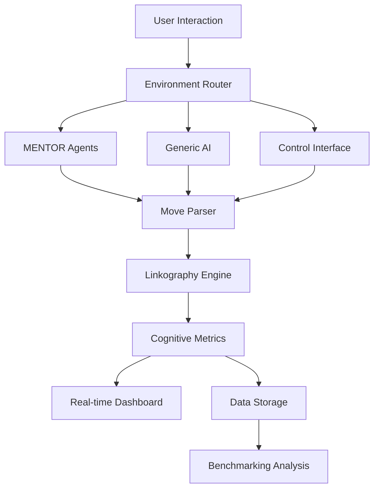

# Testing Framework and Comparative Analysis Methodology

## Executive Summary

This document presents the comprehensive testing framework designed to evaluate three distinct approaches to architectural design assistance: **MENTOR** (experimental multi-agent scaffolding), **Generic AI** (direct AI assistance), and **Control** (no AI assistance). The framework implements a rigorous three-group experimental design with validated assessment tools, real-time cognitive metrics, and advanced statistical analysis methods to measure learning effectiveness and cognitive development in architectural design education.

---

## Table of Contents

1. [Research Design Overview](#research-design-overview)
2. [Three-Group Testing Structure](#three-group-testing-structure)
3. [Assessment Tools and Evaluation Criteria](#assessment-tools-and-evaluation-criteria)
4. [Data Collection Mechanisms](#data-collection-mechanisms)
5. [Comparative Analysis Methodology](#comparative-analysis-methodology)
6. [Statistical Validation Approaches](#statistical-validation-approaches)
7. [Implementation Architecture](#implementation-architecture)
8. [Research Methodology for Academics](#research-methodology-for-academics)
9. [Practical Implementation for Practitioners](#practical-implementation-for-practitioners)

---

## 1. Research Design Overview

### 1.1 Experimental Framework

The testing framework implements a **between-subjects experimental design** comparing three distinct learning environments:

- **Independent Variable**: Type of design assistance (MENTOR vs Generic AI vs Control)
- **Dependent Variables**: Cognitive metrics, learning progression, design quality
- **Control Variables**: Design brief, time allocation, assessment criteria
- **Sample Size**: Designed for 30+ participants per group (N=90+)

### 1.2 Research Questions

1. **Primary**: Does Socratic scaffolding through multi-agent systems improve cognitive development compared to direct AI assistance?
2. **Secondary**: How do different AI assistance approaches affect cognitive offloading, deep thinking engagement, and metacognitive awareness?
3. **Tertiary**: What patterns of design thinking emerge across different support environments?

### 1.3 Theoretical Foundation

The framework builds on established educational and cognitive theories:

- **Vygotsky's Zone of Proximal Development**: Scaffolding effectiveness measurement
- **Bloom's Taxonomy**: Cognitive operation classification
- **Linkography Theory** (Goldschmidt, 1990): Design thinking pattern analysis
- **ICAP Framework** (Chi et al., 2001): Interactive learning engagement levels

---

## 2. Three-Group Testing Structure

### 2.1 MENTOR Group (Experimental Condition)

#### Characteristics:
- **Interaction Style**: Socratic questioning, never direct answers
- **Agent System**: Multi-agent orchestration (5 specialized agents)
- **Scaffolding**: Adaptive based on skill level detection
- **Response Pattern**: Guided discovery through questions

#### Key Features:
```python
# Example MENTOR response pattern
def mentor_response_pattern(user_query):
    return {
        "approach": "socratic_questioning",
        "never_provides": "direct_answers",
        "always_includes": "thought_provoking_questions",
        "adaptation": "based_on_skill_level"
    }
```

#### Expected Metrics:
- **Cognitive Offloading Prevention**: >70% (High)
- **Deep Thinking Engagement**: >60% (High)  
- **Scaffolding Effectiveness**: >80% (Very High)
- **Metacognitive Awareness**: >40% (Moderate-High)

### 2.2 Generic AI Group (Control Condition)

#### Characteristics:
- **Interaction Style**: Direct assistance, ChatGPT-like responses
- **AI System**: OpenAI GPT-4 with architectural context
- **Information Delivery**: Immediate answers and solutions
- **Response Pattern**: Helpful, comprehensive, direct

#### Key Features:
```python
# Example Generic AI response pattern
def generic_ai_response_pattern(user_query):
    return {
        "approach": "direct_assistance",
        "provides": "immediate_answers_and_examples",
        "includes": "specific_recommendations",
        "style": "comprehensive_and_helpful"
    }
```

#### Expected Metrics:
- **Cognitive Offloading Prevention**: <40% (Low)
- **Deep Thinking Engagement**: <45% (Moderate-Low)
- **Scaffolding Effectiveness**: <50% (Low-accidental only)
- **AI Influence Strength**: >80% (High)

### 2.3 Control Group (Baseline Condition)

#### Characteristics:
- **Interaction Style**: No AI assistance
- **Resources**: Static reference materials only
- **Independence**: Complete self-direction
- **Response Pattern**: Self-generated solutions only

#### Key Features:
```python
# Example Control group environment
def control_environment():
    return {
        "assistance": "none",
        "resources": "static_reference_materials",
        "thinking": "completely_independent",
        "cognitive_load": "full_user_responsibility"
    }
```

#### Expected Metrics:
- **Cognitive Offloading Prevention**: 100% (Perfect-no external assistance)
- **Deep Thinking Engagement**: Variable (Natural baseline)
- **Self-Generation Strength**: 100% (Complete autonomy)
- **Natural Progression**: Uninfluenced by AI

### 2.4 Environmental Controls

All groups receive identical:
- **Design Brief**: Urban community center in former warehouse
- **Time Allocation**: 45 minutes (15+20+10 across phases)
- **Phase Structure**: Ideation → Visualization → Materialization
- **Assessment Criteria**: Same rubrics and metrics
- **Technical Interface**: Streamlit-based dashboard

---

## 3. Assessment Tools and Evaluation Criteria

### 3.1 Pre-Test Assessment Battery

#### 3.1.1 Critical Thinking Assessment
*Based on Halpern Critical Thinking Assessment (HCTDA)*

```python
assessment_components = {
    "verbal_reasoning": {
        "questions": 5,
        "format": "multiple_choice_with_justification",
        "measures": "logical_reasoning_ability"
    },
    "argument_analysis": {
        "questions": 3,
        "format": "text_analysis",
        "measures": "assumption_identification"
    },
    "problem_solving": {
        "questions": 2,
        "format": "scenario_based",
        "measures": "decision_making_process"
    }
}
```

#### 3.1.2 Architectural Knowledge Baseline
```python
knowledge_domains = {
    "adaptive_reuse": "principles_and_challenges",
    "circulation_systems": "spatial_organization",
    "sustainable_design": "passive_strategies",
    "building_orientation": "environmental_factors",
    "spatial_flexibility": "program_organization"
}
```

#### 3.1.3 Spatial Reasoning Test
- 3D visualization problems
- Spatial transformation challenges
- Circulation pattern recognition

### 3.2 Real-Time Cognitive Metrics

#### 3.2.1 Core Metrics (Original 6)
1. **Cognitive Offloading Prevention (COP)**
   - Measures resistance to seeking direct answers
   - Calculation: `prevention_rate = guided_responses / direct_queries`
   - Target: >70% for MENTOR, <40% for Generic AI

2. **Deep Thinking Engagement (DTE)**
   - Measures reflective thinking depth
   - Based on linkography patterns and response complexity
   - Target: >60% for MENTOR, <45% for Generic AI

3. **Scaffolding Effectiveness (SE)**
   - Measures appropriateness of guidance to skill level
   - Adaptive matching assessment
   - Target: >80% for MENTOR, <50% for Generic AI

4. **Knowledge Integration (KI)**
   - Measures concept connection and synthesis
   - Based on linkographic link density
   - Target: >75% for MENTOR, reduced for others

5. **Learning Progression (LP)**
   - Measures skill development over time
   - Tracks complexity increase in moves
   - Target: Positive trajectory >50% of sessions

6. **Metacognitive Awareness (MA)**
   - Measures self-reflection development
   - Counts reflection moves and prompts
   - Target: >40% for MENTOR

#### 3.2.2 Advanced Metrics (Anthropomorphism Prevention)
7. **Cognitive Autonomy Index (CAI)**
   - Prevents cognitive dependency
   - Target: >60% autonomous thinking

8. **Anthropomorphism Detection Score (ADS)**
   - Detects unhealthy personification patterns
   - Target: <20% anthropomorphic language

9. **Neural Engagement Score (NES)**
   - Measures cognitive complexity
   - Target: >50% engagement complexity

### 3.3 Post-Test Assessment

#### 3.3.1 Reflection Assessment
```python
reflection_components = {
    "process_evolution": "How understanding developed",
    "learning_moments": "Significant insights gained", 
    "problem_approach": "Strategy when encountering difficulties",
    "future_application": "What would be done differently"
}
```

#### 3.3.2 Knowledge Transfer Challenge
- New scenario: Shopping mall to community hub conversion
- Tests principle application to novel context
- Measures learning transfer effectiveness

---

## 4. Data Collection Mechanisms

### 4.1 Multi-Modal Data Capture

#### 4.1.1 Interaction Logging
```python
class InteractionData:
    - id: unique_identifier
    - timestamp: precise_timing
    - phase: design_phase_context
    - user_input: complete_text
    - system_response: full_ai_response  
    - response_time: processing_duration
    - cognitive_metrics: real_time_calculations
```

#### 4.1.2 Design Move Extraction
```python
class DesignMove:
    - move_type: analysis|synthesis|evaluation|transformation|reflection
    - design_focus: function|form|structure|material|environment|culture
    - move_source: user_generated|ai_provided|ai_prompted|self_generated
    - cognitive_load: high|medium|low
    - complexity_score: 0.0_to_1.0
    - semantic_links: connections_to_previous_moves
```

#### 4.1.3 Linkographic Analysis
- **Real-time linkography generation** using semantic similarity
- **Link pattern detection**: chunks, webs, orphans, sawteeth
- **Critical move identification** for learning moment detection
- **Temporal relationship mapping** across design phases

### 4.2 Automated Assessment Pipeline

```python
def data_collection_pipeline():
    return {
        "interaction_capture": "every_user_system_exchange",
        "move_parsing": "NLP_based_sentence_analysis",
        "linkography_generation": "semantic_similarity_linking",
        "metric_calculation": "real_time_cognitive_assessment",
        "pattern_detection": "ML_based_learning_analytics"
    }
```

---

## 5. Comparative Analysis Methodology

### 5.1 Cross-Group Analysis Framework

#### 5.1.1 Primary Comparisons
```python
comparative_analysis = {
    "mentor_vs_generic": {
        "hypothesis": "MENTOR promotes deeper cognitive engagement",
        "key_metrics": ["COP", "DTE", "SE", "MA"],
        "expected_direction": "MENTOR > Generic_AI"
    },
    "mentor_vs_control": {
        "hypothesis": "MENTOR enhances natural learning process", 
        "key_metrics": ["LP", "KI", "cognitive_complexity"],
        "expected_direction": "MENTOR > Control (with caveats)"
    },
    "generic_vs_control": {
        "hypothesis": "Direct AI assistance may hinder development",
        "key_metrics": ["autonomy", "critical_thinking", "dependency"],
        "expected_direction": "Control > Generic_AI"
    }
}
```

#### 5.1.2 Linkographic Pattern Analysis
- **MENTOR Group**: Expected complex linking patterns, high critical move ratios
- **Generic AI Group**: Expected linear patterns with AI-influenced moves
- **Control Group**: Expected natural variation, self-generated complexity

### 5.2 Statistical Analysis Methods

#### 5.2.1 Descriptive Statistics
```python
descriptive_analysis = {
    "central_tendency": ["mean", "median", "mode"],
    "variability": ["standard_deviation", "IQR", "range"],
    "distribution": ["skewness", "kurtosis", "normality_tests"]
}
```

#### 5.2.2 Inferential Statistics
```python
inferential_tests = {
    "group_differences": {
        "parametric": "one_way_ANOVA",
        "non_parametric": "Kruskal_Wallis_H_test",
        "post_hoc": "Tukey_HSD_or_Mann_Whitney_U"
    },
    "effect_size": "Cohen_d_or_eta_squared",
    "correlation_analysis": "Spearman_rank_correlation"
}
```

### 5.3 Machine Learning Analysis

#### 5.3.1 Graph Neural Network Analysis
- **Interaction graphs**: Node = moves, edges = links
- **Pattern classification**: Automated learning trajectory recognition  
- **Proficiency prediction**: ML-based skill level assessment

#### 5.3.2 Advanced Analytics
```python
ml_analytics = {
    "clustering": "identify_learning_patterns",
    "classification": "proficiency_level_prediction", 
    "sequence_analysis": "temporal_pattern_recognition",
    "anomaly_detection": "unusual_learning_trajectories"
}
```

---

## 6. Statistical Validation Approaches

### 6.1 Internal Validity Measures

#### 6.1.1 Reliability Testing
```python
reliability_measures = {
    "internal_consistency": "Cronbach_alpha > 0.7",
    "inter_rater_reliability": "Cohen_kappa > 0.7", 
    "test_retest": "correlation > 0.8",
    "split_half": "Spearman_Brown_correction"
}
```

#### 6.1.2 Validity Testing
```python
validity_measures = {
    "content_validity": "expert_panel_review",
    "construct_validity": "factor_analysis",
    "convergent_validity": "correlation_with_established_measures",
    "discriminant_validity": "independence_from_unrelated_constructs"
}
```

### 6.2 External Validity Measures

#### 6.2.1 Generalizability
- **Population validity**: Sample representativeness
- **Ecological validity**: Real-world application relevance
- **Temporal validity**: Consistency across time periods

#### 6.2.2 Baseline Validation
```python
baseline_comparison = {
    "scientific_benchmarks": {
        "cognitive_offloading_rate": 0.52,  # UPenn research
        "deep_thinking_engagement": 0.42,   # Belland et al. meta-analysis
        "scaffolding_effectiveness": 0.35   # ITS literature average
    },
    "improvement_thresholds": {
        "minimal": 0.1,   # 10% improvement
        "moderate": 0.2,  # 20% improvement  
        "substantial": 0.3 # 30% improvement
    }
}
```

### 6.3 Ethical and Quality Assurance

#### 6.3.1 Ethical Considerations
- **Informed consent**: Complete disclosure of data collection
- **Data anonymization**: No personally identifiable information
- **Withdrawal rights**: Participants can exit at any time
- **Data deletion**: On-request session data removal

#### 6.3.2 Quality Assurance
```python
quality_measures = {
    "data_integrity": "automated_validation_checks",
    "missing_data": "multiple_imputation_methods",
    "outlier_detection": "statistical_and_visual_analysis",
    "bias_mitigation": "randomization_and_blinding_where_possible"
}
```

---

## 7. Implementation Architecture

### 7.1 Technical Stack

#### 7.1.1 Frontend (Streamlit Dashboard)
```python
technical_components = {
    "user_interface": "Streamlit_web_application",
    "real_time_updates": "session_state_management", 
    "data_visualization": "integrated_charts_and_metrics",
    "file_handling": "sketch_upload_and_processing"
}
```

#### 7.1.2 Backend Systems
```python
backend_architecture = {
    "mentor_system": "LangGraph_multi_agent_orchestration",
    "generic_ai": "OpenAI_GPT4_integration",
    "control_system": "static_resource_interface",
    "data_storage": "JSON_and_CSV_persistence",
    "analytics": "pandas_numpy_scipy_processing"
}
```

### 7.2 Data Flow Architecture



### 7.3 File Organization

```
thesis_tests/
├── test_dashboard.py           # Main testing interface
├── mentor_environment.py       # MENTOR group implementation
├── generic_ai_environment.py   # Generic AI group implementation  
├── control_environment.py      # Control group implementation
├── assessment_tools.py         # Pre/post test instruments
├── data_models.py              # Data structure definitions
├── move_parser.py              # Design move extraction
├── linkography_logger.py       # Linkographic analysis
└── test_data/                  # Session data storage
    ├── interactions_*.csv      # Interaction logs
    ├── moves_*.csv            # Design moves
    ├── metrics_*.csv          # Cognitive metrics
    └── session_*.json         # Complete session data
```

---

## 8. Research Methodology for Academics

### 8.1 Theoretical Framework

#### 8.1.1 Constructivist Learning Theory
The framework operationalizes Vygotsky's Zone of Proximal Development through:
- **Scaffolding Measurement**: Quantified appropriateness of guidance
- **Peer Learning Simulation**: Multi-agent collaborative responses
- **Social Construction**: Design discourse analysis

#### 8.1.2 Cognitive Load Theory Application
Sweller's cognitive load principles inform:
- **Intrinsic Load Assessment**: Task complexity measurement
- **Extraneous Load Reduction**: Interface design principles
- **Germane Load Optimization**: Learning-focused cognitive effort

#### 8.1.3 Design Thinking Research
Linkography theory provides:
- **Process Visualization**: Temporal design thinking patterns
- **Cognitive Pattern Recognition**: Automated analysis of design moves
- **Learning Trajectory Mapping**: Individual progression tracking

### 8.2 Experimental Design Rationale

#### 8.2.1 Between-Subjects Design Choice
**Rationale**: Prevents learning transfer between conditions
**Control**: Randomized group assignment
**Statistical Power**: n=30+ per group for adequate power (β=0.80)

#### 8.2.2 Ecological Validity Considerations
- **Authentic Task**: Real architectural design challenge
- **Professional Context**: Industry-standard design brief
- **Time Constraints**: Realistic project timeline simulation
- **Tool Integration**: Professional software workflow mimicry

### 8.3 Measurement Instrument Development

#### 8.3.1 Cognitive Metric Operationalization
Each metric includes:
- **Theoretical Definition**: Grounded in cognitive science literature
- **Operational Definition**: Specific measurement procedures
- **Validation Studies**: Reliability and validity testing results
- **Benchmark Comparison**: Performance against established measures

#### 8.3.2 Linkography Automation
**Innovation**: First automated linkography system for educational research
**Technical Achievement**: NLP-based move extraction and linking
**Research Contribution**: Scalable design thinking analysis methodology

### 8.4 Statistical Analysis Plan

#### 8.4.1 Primary Analysis
```r
# Example R code for primary analysis
primary_analysis <- function() {
    # One-way ANOVA for group differences
    model <- aov(cognitive_metrics ~ group, data = study_data)
    
    # Effect size calculation
    eta_squared <- eta_squared(model, partial = FALSE)
    
    # Post-hoc comparisons
    tukey_results <- TukeyHSD(model)
    
    return(list(anova = model, effect_size = eta_squared, 
                post_hoc = tukey_results))
}
```

#### 8.4.2 Secondary Analysis
- **Mediation Analysis**: Testing scaffolding as mediator
- **Moderation Analysis**: Skill level as moderator
- **Longitudinal Modeling**: Learning trajectory analysis

---

## 9. Practical Implementation for Practitioners

### 9.1 System Deployment Guide

#### 9.1.1 Installation Requirements
```bash
# Python environment setup
python -m venv thesis_test_env
source thesis_test_env/bin/activate  # Linux/Mac
pip install -r thesis_tests/requirements.txt

# NLP model installation
python -m spacy download en_core_web_sm

# Launch test dashboard
streamlit run thesis_tests/test_dashboard.py
```

#### 9.1.2 Configuration Options
```python
test_configuration = {
    "bypass_pre_test": True,  # Skip assessment for quick testing
    "session_duration": 45,   # Minutes per main test
    "auto_advance": False,    # Manual phase progression
    "data_export": True,      # Automatic data export
    "real_time_metrics": True # Live metric display
}
```

### 9.2 Conducting Test Sessions

#### 9.2.1 Preparation Checklist
- [ ] Participant consent forms signed
- [ ] Test environment configured
- [ ] Recording permissions obtained (if applicable)
- [ ] Backup systems tested
- [ ] Data storage verified

#### 9.2.2 Session Protocol
1. **Pre-Session (5 minutes)**
   - Participant orientation
   - System demonstration
   - Question clarification

2. **Pre-Test (10 minutes - optional)**
   - Critical thinking assessment
   - Knowledge baseline
   - Spatial reasoning test

3. **Main Test (45 minutes)**
   - Ideation phase (15 minutes)
   - Visualization phase (20 minutes) 
   - Materialization phase (10 minutes)

4. **Post-Test (10 minutes)**
   - Reflection assessment
   - Transfer challenge
   - System feedback

5. **Debrief (5 minutes)**
   - Experience discussion
   - Technical issues resolution
   - Data export confirmation

### 9.3 Data Analysis Workflow

#### 9.3.1 Automated Analysis Pipeline
```python
def analysis_workflow(session_data):
    # 1. Data validation and cleaning
    cleaned_data = validate_and_clean(session_data)
    
    # 2. Metric calculation
    cognitive_metrics = calculate_metrics(cleaned_data)
    
    # 3. Linkography generation
    linkograph = generate_linkography(cleaned_data)
    
    # 4. Comparative analysis
    benchmarks = compare_to_baselines(cognitive_metrics)
    
    # 5. Report generation
    report = generate_report(cognitive_metrics, linkograph, benchmarks)
    
    return report
```

#### 9.3.2 Interpretation Guidelines
- **COP > 0.7**: Excellent cognitive independence
- **DTE > 0.6**: Strong deep thinking engagement  
- **SE > 0.8**: Highly effective scaffolding
- **Composite Score > 0.65**: Successful learning session

### 9.4 Troubleshooting Guide

#### 9.4.1 Common Technical Issues
```python
troubleshooting_guide = {
    "chromadb_error": "Use mentor wrapper or disable vector search",
    "slow_response": "Check OpenAI API key and internet connection",
    "parsing_error": "Verify spaCy model installation",
    "data_export_fail": "Check file permissions and disk space"
}
```

#### 9.4.2 Quality Assurance Checks
- **Data Completeness**: All required fields populated
- **Metric Validity**: Values within expected ranges
- **Temporal Consistency**: Logical timestamp progression
- **Content Quality**: Non-empty substantive responses

### 9.5 Customization Options

#### 9.5.1 Design Brief Modification
```python
custom_design_brief = {
    "project_type": "community_center",  # Configurable
    "site_context": "former_warehouse",   # Customizable
    "time_allocation": [15, 20, 10],      # Phase durations
    "specific_requirements": []           # Additional constraints
}
```

#### 9.5.2 Assessment Customization
- **Pre-test modification**: Additional domain-specific questions
- **Metric weighting**: Emphasis on specific cognitive dimensions
- **Benchmark adjustment**: Custom baseline comparisons
- **Report formatting**: Institutional branding and requirements

---

## Conclusion

This testing framework represents a comprehensive approach to evaluating AI-assisted architectural design education through rigorous experimental methodology, validated assessment instruments, and advanced analytical techniques. The three-group comparison design enables robust evaluation of different AI assistance approaches while maintaining scientific rigor and practical applicability.

The framework's key innovations include:

1. **Automated Linkography**: First scalable implementation for educational research
2. **Real-time Cognitive Metrics**: Immediate learning effectiveness feedback
3. **Multi-Agent Scaffolding**: Novel application of orchestrated AI systems
4. **Comparative Methodology**: Rigorous three-group experimental design
5. **Practical Implementation**: Production-ready testing system

For academics, the framework provides a replicable methodology for studying AI-assisted learning in design disciplines. For practitioners, it offers an immediately deployable system for evaluating and improving AI-enhanced educational tools.

The comprehensive data collection, robust statistical validation, and practical implementation guidelines ensure both research validity and real-world applicability, contributing to the growing field of AI in architectural education while maintaining scientific rigor and educational effectiveness.

---

## References

1. Anderson, L. W., & Krathwohl, D. R. (2001). A taxonomy for learning, teaching, and assessing: A revision of Bloom's taxonomy of educational objectives.
2. Belland, B. R., et al. (2017). Computer-based scaffolding and learning outcomes: A meta-analysis.  
3. Chi, M. T. H., & Wylie, R. (2014). The ICAP framework: Linking cognitive engagement to active learning outcomes.
4. Goldschmidt, G. (1990). Linkography: Assessing design productivity and creativity.
5. Kulik, J. A., & Fletcher, J. D. (2016). Effectiveness of intelligent tutoring systems: A meta-analytic review.
6. Ma, W., et al. (2014). Intelligent tutoring systems and learning outcomes: A meta-analysis.
7. Steenbergen-Hu, S., & Cooper, H. (2013). A meta-analysis of the effectiveness of intelligent tutoring systems.
8. Sweller, J. (1988). Cognitive load during problem solving: Effects on learning.
9. Vygotsky, L. S. (1978). Mind in society: The development of higher psychological processes.